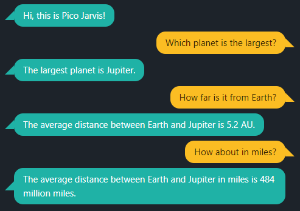

# Pico Jarvis



First, you need to run the [API server](https://github.com/ggerganov/llama.cpp/blob/master/examples/server/README.md) of [llama.cpp](https://github.com/ggerganov/llama.cpp) with [Mistral 7B OpenOrca](https://huggingface.co/TheBloke/Mistral-7B-OpenOrca-GGUF), e.g.:
```
./server -m /path/to/mistral-7b-openorca.Q4_K_M.gguf
```

(For a quicker response with potentially reduced accuracy, consider using [Phi 2](https://huggingface.co/TheBloke/phi-2-GGUF) ` Q5_K_M`).


To launch Pico Jarvis, you need [Node.js](https://nodejs.org/) v18 or later:
```
npm install
npm start
```

and then open `localhost:5000`.

Ask the following questions:

* Who wrote the Canon of Medicine?
* Is ramen typically eaten in Egypt?
* Who directed the Dark Knight movie?
* Name Indonesia #1 tourist destination!

<details>
<summary>(and some more to try)</summary>

* What is the native language of Mr. Spock?
* Which US state starts with G?
* What is the atomic number of Magnesium?
* Where do we find kangoroo?
* Who is the father of Luke Skywalker?
* In which country Mandarin is spoken?
* What is the longest river in Latin America?
* Who authored the special theory of relativity?
* Which fictional metal is infused into Wolverine body?
* Who sailed with the flagship Santa Maria?
* Name the big desert close to Mongolia
* Which is closer to Singapor: Vietnam or Australia?
* Who is the fictional spy 007?
* Which country is known for IKEA?

</details>

Meanwhile, questions related the solar system will be answered by searching the PDF document:

* How many planets are there in our solar system?
* Is Pluto a planet?
* When was solar system formed?
* Which materials made up the gas giants?
* How far is Proxima Centauri?

If you get an API key for [OpenWeatherMap](https://api.openweathermap.org) and supply it as `OPENWEATHERMAP_API_KEY` environment variable, try to ask the following:

* How is the weather in Jakarta?
* What is the current temperature in Palo Alto?
* Is it currently cloudy in Seattle?